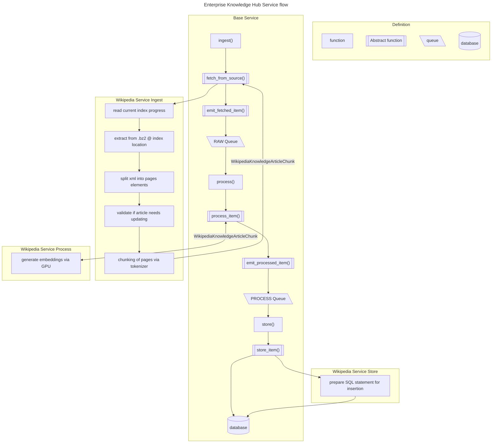

# Flowchart

Here is the flowchart of our EKH service.

```mermaid
---
title: Enterprise Knowledge Hub Service flow
---
flowchart TB
    subgraph "Definition"
        direction TB
        bfunc["function"]
        afunc[["Abstract function"]]
        q[\queue\]
        database[(database)]
    end
    subgraph "Base Service"
        direction TB
        ingest["ingest()"] --> fetch[["fetch_from_source()"]]
        fetch --> emit_fetch[["emit_fetched_item()"]]
        emit_fetch --> RAWQ[\RAW Queue\]
        RAWQ --> process["process()"]
        process --> processing[["process_item()"]]
        processing --> emit[["emit_processed_item()"]]
        emit --> PQ[\PROCESS Queue\]
        PQ --> store["store()"]
        store --> store_item[["store_item()"]]
        store_item --> db[(database)]
    end

    subgraph "Wikipedia Service Ingest"
        fetch --> index["read current index progress"]
        index --> unzip["extract from .bz2 @ index location"]
        unzip --> split["split xml into pages elements"]
        split --> validate["validate if article needs updating"]
        validate --> chunk["chunking of pages via tokenizer"]
        chunk -->|WikipediaKnowledgeArticleChunk| fetch
    end

    subgraph "Wikipedia Service Process"
        processing <-->|WikipediaKnowledgeArticleChunk| embed["generate embeddings via GPU"]
    end

    subgraph "Wikipedia Service Store"
        store_item --> cdb["prepare SQL statement for insertion"]
        cdb --> db
    end
```