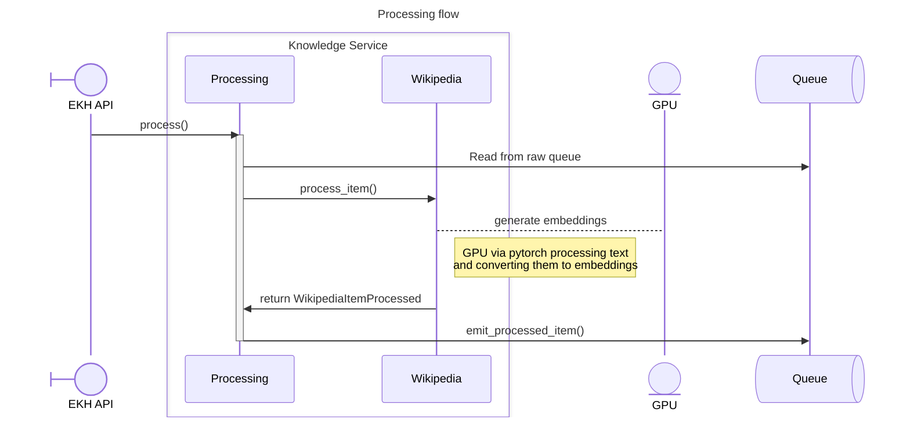
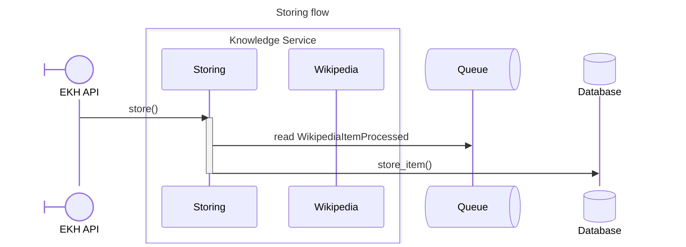

# Enterprise Knowledge Hub (EKH) Flow

The purpose of this document is to show how the EKH works.

## Knowledge Service

The two main purpose of this service is to create embeddings from source material and allow user to query those embeddings:

  * `knowledge/<impl>/run` will create the information and store it in a database
  * `knowledge/<impl>/search` will allow use to query the embeddings

### Knowledge Service Run

The knowledge service runs aim to:

  1) **ingest** content; read from the source (ex: wikipedia articles)
  2) **process** content; use GPU and an embedding model to generate vectors
  3) **store** content; store the vectors generated above in a database

Note that those 3 steps are performed in parallel due to the nature of it. **Ingestion** adds item to a queue, **process** reads item from the queue and writes the outcome in a different queue, and **store** reads the procssed items to store them in a database. 

#### Ingest

```mermaid
---
title: Ingestion flow
---
sequenceDiagram
    participant API@{ "type": "boundary" } as EKH API

    box Knowledge Service
    participant ingest as Ingesting
    participant impl as Wikipedia
    end

    participant archive@{ "type" : "entity" }

    participant queue@{ "type" : "queue" } as Queue

    API->>ingest: ingest()
    activate ingest
    ingest->>impl: fetch_from_source()
    impl-->: decompress .bz2 archive
    Note right of impl: Read source material<br/>from the bz2 multipart archive
    impl->>ingest: return KnowledgeItem(s)
    ingest->>queue: write KnowledgeItem(s)
    deactivate ingest
```

#### Process



> Note: Processing is batched via BatchHandler for Wikipedia, thus several items at a time are processed.

#### Store



### Knowledge Service Query

TODO